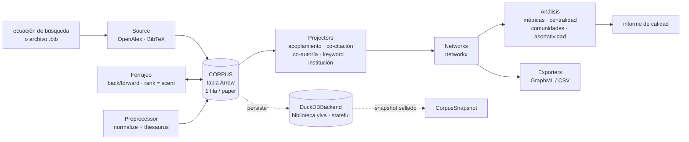

# ARQUITECTURA — bib2graph

> Diseño de la librería: un **núcleo puro rodeado de costuras**, apoyado en una capa base de
> vocabulario y modelos. El **producto NO usa IA generativa** (ADR
> [0022](decisiones/0022-producto-sin-ia-generativa.md)): la asistencia del forrajeo es **estructura
> bibliométrica determinista** (*information scent*), sin LLM ni embeddings. El desarrollo sí es
> asistido por IA; el producto no. El "porqué" de cada decisión vive en los ADR de
> [`decisiones/`](decisiones/) (linkeados en cada sección); el método en
> `Notas/metodología.md`; los contratos públicos en [`API.md`](API.md).

## 1. Idea en un párrafo

`bib2graph` es **un núcleo puro rodeado de costuras**, apoyado en una **capa base de vocabulario
y modelos**. La **capa base** (`constants`, `schemas`; ADR
[0023](decisiones/0023-capa-constants-modelos-schema.md)) es la **fuente única** de nombres de
columna, estados de curación, tipos de red y del evento de procedencia (`ProvenanceEvent` vive en
`schemas.py`, no en un `models.py` separado) — todo el resto depende de ella. El **núcleo puro** opera
sobre un `Corpus` en memoria (una **tabla canónica Arrow**) y nunca hace red ni servidores: proyecta el
corpus a redes, las analiza y las exporta, normaliza/cura la tabla, y **modela el ciclo** de
investigación como una máquina de estados de dominio (`cycle.py`, ADR
[0016](decisiones/0016-maquina-estados-lazo.md)). Alrededor hay costuras: **`Source`** (sembrar
el corpus por **ingesta de doble puerta** —ecuación de búsqueda **o** archivo `.bib`, ambas
**primarias**; ADR [0035](decisiones/0035-ingesta-multipuerta-resolucion-doi.md)— con *OpenAlex* como
motor de extracción de referencia, intercambiable), el **forrajeo/chaining** (expandir el corpus
rankeando candidatos por *information scent* — **estructura bibliométrica determinista, sin IA**),
**`Store`** (persistir — *DuckDB stateful por defecto*: la **biblioteca viva**) y `Enricher` (señal
extra, opt-in). El flujo **no es lineal**: es el **ciclo iterativo** de exploración (sembrar →
forrajear → curar → la idea muta → re-sembrar), y la biblioteca viva en DuckDB es el sustrato que lo
sostiene entre corridas.

La frontera de frontera es el **CLI `b2g`** (Click, agente-native, ADR 0010/0021): la columna que
humanos y agentes usan para correr el ciclo. No hay GUI ni servidor web en la librería (la experiencia
visual library-centric vive en un producto separado; ADR [0040](decisiones/0040-retiro-gui-local.md)).

## 2. Vista de alto nivel



*Detalle anotado del mismo flujo (con topes, procedencia y estado del ciclo):*

```
   ecuación de búsqueda
          │  (traducción + reporte de traducción, ADR 0007)
          ▼
   ┌──────────────┐      ┌─────────────┐      ┌────────────┐     ┌──────────┐
   │   Source     │ ───► │   CORPUS    │ ───► │ Projector  │ ──► │ Network  │ ──► Analyzer
   │  OpenAlex    │      │ tabla Arrow │      │ coupling   │     │ networkx │     (métricas,
   │  + BibTeX    │      │ (1 fila/    │      │ co-citación│     └──────────┘      centralidad,
   └──────────────┘      │  paper)     │      │ co-autoría │          │           comunidades,
          ▲              │  is_seed,   │      │ keyword    │          ▼           asortatividad)
          │ chaining     │  status,    │      │ institución│     ┌──────────┐          │
   ┌──────────────┐      │  provenance │      └────────────┘     │ Exporter │          ▼
   │  FORRAJEO    │◄────►│  + refs/    │             ▲           │GraphML/CSV│   ┌──────────┐
   │ back/forward │      │  citas      │             │           └──────────┘   │ informe  │
   │ rank=scent   │      │  (OpenAlex) │             │                          │ calidad  │
   └──────────────┘      └─────────────┘      ┌────────────┐                    └──────────┘
   (preview, tope,              ▲             │Preprocessor│
    profundidad 1)              │             │ normalize +│
                                ▼             │ thesaurus  │
                        ┌─────────────┐       └────────────┘
                        │ DuckDBBackend│  BACKEND POR DEFECTO del CORPUS (biblioteca viva,
                        │  del CORPUS  │  ADR 0015): stateful, acepta/rechaza, crece entre
                        │  (stateful)  │  corridas, log de procedencia + estado del ciclo
                        │              │  (CycleState + ronda; dominio en cycle.py, ADR 0016).
                        │ DuckDBStore  │  Snapshot = export sellado. 1 archivo = 1 escritor
                        │  = fachada   │  (single-writer, ADR 0019). Store/Zotero/Neo4j
                        │              │  = costura externa opt-in, NO la persistencia primaria.
                        └─────────────┘
```

El **`DuckDBBackend` es el backend por defecto del `Corpus`** (ADR
[0015](decisiones/0015-corpus-tabular-backend.md)), no un `Store` separado: persiste, muta por SQL y
aloja el `CycleState` (ADR [0016](decisiones/0016-maquina-estados-lazo.md)). El **`DuckDBStore` es su
fachada** de costura; la costura `Store` (`ZoteroStore`/`Neo4jStore`) es el punto de extensión externo
opt-in. El sensemaking lo hace el **humano** leyendo las redes — no hay IA generativa en el producto.

## 3. El núcleo (puro, sin red ni servidores)

Dependencias del núcleo puro: `pyarrow`, `pydantic`, `networkx`, `click`, `tqdm`. **Nada de red
ni servidores** en proyección/análisis/normalización: todo el núcleo es unitariamente testeable
con tablas sintéticas. (El `Source` OpenAlex y el `Store` DuckDB se instalan por defecto y sí
hacen I/O, pero son **costuras**: el núcleo puro no depende de ellas — ver §4.)

### 3.1 `Corpus` — el contrato central (tabla canónica Arrow sobre un `TabularBackend`)

El `Corpus` es la **única fuente de verdad del modelo** y el formato que circula por el
pipeline. Su contenido es **una sola tabla Arrow** (`pa.Table`) con schema fijo por paper,
validada por el wrapper público con **Pydantic v2** (ADR 0006). `Paper`/`Author`/`Keyword`/
`Institution` **no son tipos del modelo**: son **vistas derivadas** vía `groupby + explode`.

El `Corpus` se respalda en un `TabularBackend` (Protocol) y **delega las mutaciones** (ADR
[0015](decisiones/0015-corpus-tabular-backend.md)): `InMemoryBackend` (puro, tests + working set
efímero) o `DuckDBBackend` (biblioteca viva por defecto, mutación por SQL `UPDATE`/`MERGE` por
`id`). El **núcleo no importa `duckdb`**: depende del Protocol. `corpus.to_arrow()` es el **puente
estable a los proyectores/analizadores puros** — solo cambia el *contenedor*, no el núcleo de
análisis. Las reglas de identidad/hash/merge (ADR
[0013](decisiones/0013-identidad-hash-merge-corpus.md), D1/D2/D3) son contrato que cada backend
cumple a su manera. Los loaders (seed, BibTeX, Forager) construyen la tabla Arrow **de una vez** con
`Corpus.from_arrow` (carga bulk, no upsert por fila).

**Columnas** (esquema completo en [`API.md`](API.md) §1): identidad/metadatos (`id` interno estable
—hash de `doi`/`source_id`, ADR 0036—, `source_id` agnóstico al motor, `doi`, `title`, `year`,
`abstract`, `source`, `language`, …); **estado de pipeline/curación** que no contamina la entidad
(`is_seed`, `curation_status` ∈ {`candidate`,`accepted`,`rejected`}, `provenance` = log append-only,
ADR 0009); **relaciones de entrada** crudas (`authors_*`, `keywords_*`, `institutions_*`,
`references_id`/`references_doi`, `cited_by_id` — **de OpenAlex**, ya no de un Enricher, ADR 0007).
Las **relaciones derivadas** (`BIB_COUPLED_WITH`, `CO_CITED_WITH`, `COLLABORATED_WITH`,
`CO_OCCURRENCE`) las producen los Proyectores y **no viven en el corpus**.

### 3.2 `Projector` — corpus → red

Toma un `Corpus` y devuelve un `networkx.Graph` ponderado:

| Red | Proyección | Insumo en el corpus | Costo |
|-----|------------|---------------------|-------|
| **acoplamiento bibliográfico** | papers que **comparten referencias** | `references_id` (OpenAlex, ya en el corpus) | barato; **sobre corpus completo**, no solo semillas |
| co-citación | papers **citados juntos** | `cited_by_id` + citas de los citantes | **el más caro** (2º nivel de fetch) |
| colaboración de autores | autores que co-firman | `authors_id` | barato |
| colaboración de instituciones | instituciones vía co-firmas | `institutions_id` | barato |
| co-ocurrencia de keywords | keywords juntas en un paper | `keywords_id` (normalizadas por thesaurus) | barato |

Con OpenAlex como backbone, las referencias y los citantes **ya vienen en el corpus**; el `Enricher`
deja de ser estructural. El **acoplamiento** (barato, mira hacia adelante, usa refs que las semillas
ya traen) es **ciudadano de primera**. La **co-citación** sigue siendo la más cara: necesita los
citantes *con sus propias citas* (segundo nivel de fetch, que puebla `cited_by_id`). El acoplamiento
opera sobre el **corpus completo**, no solo `is_seed`. La co-citación end-to-end está cableada: la
pasada de enriquecimiento puebla `cited_by_id` y `Networks.quick` incluye la red cuando esa columna
tiene datos.

### 3.3 `Analyzer` — red → resultados

Funciones puras sobre `networkx.Graph`: **métricas** (densidad, componentes, clustering),
**centralidad** (grado, intermediación), **comunidades** (Louvain —declara `python-louvain`, falla
fuerte si falta—, propagación, modularidad voraz), **asortatividad** (por un **atributo categórico
configurable** —p. ej. región— y por grado, más la **composición de cada comunidad**; las métricas
sobre un **proxy** se reportan con su disclaimer; el atributo es config del usuario, no hardcodeado) e
**informe de calidad** de la co-citación (`metodología.md` §4, umbrales
configurables).

### 3.4 `Exporter` — resultados → archivos

GraphML y CSV (nodos y aristas). I/O de salida puro y predecible, sin backend.

### 3.5 Forrajeo / chaining (asistido por estructura bibliométrica, SIN IA)

Orquestación pura sobre la costura `Source`: dado el corpus actual, computa candidatos por
**backward chaining** (referencias de las semillas) y **forward chaining** (citantes), y los
**rankea por *information scent***. El *information scent* es **estructura bibliométrica
determinista y reproducible**, **sin LLM ni embeddings** (ADR
[0020](decisiones/0020-metodo-forrajeo-scent-filtros-reject.md);
[0022](decisiones/0022-producto-sin-ia-generativa.md)): el forrajeo **consume el núcleo de
proyección** (§3.2, primitivo `collect_item_to_papers`), nunca al revés. Es función pura y
determinista (mismo corpus → mismo ranking).

- **Backward** = **fuerza de co-citación con el corpus** (cuántos corpus-papers listan al candidato en
  `references_id`; no toca la red). **Observa sin materializar:** los IDs van a la tabla hermana
  `referenced_but_not_fetched`, fuera del `corpus_hash`, no a filas-fantasma del corpus.
- **Forward** = **fuerza de citación directa al corpus** (señal primaria, robusta). **Materializa
  filas reales** con la metadata que la query de citantes ya trae (cero red extra). Exige
  `source.fetch_citing(...)` (capacidad de `OpenAlexSource`, no del Protocol `Source`).

Reglas (ADR 0008): **profundidad 1 por defecto** (`depth>1` lanza `NotImplementedError`); **preview de
crecimiento sin red** (backward exacto local; forward no estimable sin fetch) y **tope**
(`max_candidates`) configurable; **pool cortés** de OpenAlex. **No hay paso de IA:** el "porqué" de un
candidato lo explica la **estructura visible**, no un LLM.

> **Sesgo de confirmación:** rankear por estructura ya presente refuerza lo central y popular (efecto
> Mateo). El scent es ayuda de **priorización**, no de **exhaustividad**: la exhaustividad PRISMA la
> sostienen los filtros y el conteo de exclusiones, no el scent.

### 3.6 `Preprocessor` — normalización (núcleo)

Determinístico e idempotente: canonicalización **conservadora** de nombres de autor
(`authors_id`: lowercase + acentos + espacios) y `language` (ISO 639-1 primario), y
**normalización de keywords vía thesaurus multilingüe** (en/es/pt; dict `canónico → aliases` en
JSON portable; ADR 0011). Lo *fuzzy* (dedup aproximado de autores y keywords) corre
**automáticamente en la ingesta** con `rapidfuzz` **en el núcleo** (ADR
[0031](decisiones/0031-preprocesamiento-automatico-en-ingesta.md), #88). **No hay fallback
semántico/LLM del thesaurus** (ADR 0011/0022): el thesaurus es **curado y determinista**; lo que no
matchea queda fuera, sin inventar conceptos con un modelo.

## 4. Las costuras (puntos de extensión)

Contratos tipados y estables (Protocols / ABCs; ver [`API.md`](API.md)). El núcleo no conoce
implementaciones concretas: las recibe inyectadas.

### 4.1 `Source` — sembrar un corpus

Convierte una entrada externa en `Corpus`. El contrato es **agnóstico de la forma de OpenAlex**
(ADR [0018](decisiones/0018-source-agnostico-calidad.md)): separa el **mínimo universal**
(`id`, `title`, `year`, `authors_raw`, `keywords_raw` — habilita ya co-autoría y co-word) del
**enriquecimiento opcional** (`references_id`/`references_doi`, `cited_by_id`, afiliaciones
per-autor, `institutions_id` — habilita acoplamiento, co-citación, instituciones, asortatividad).
Una `Source` que solo entrega el mínimo es legítima; los proyectores de enriquecimiento producen
redes parciales y lo reportan (no fallan). Esto habilita fuentes regionales (SciELO, Redalyc, La
Referencia) sin obligarlas a entregar lo que no tienen.

**Implementación de referencia: OpenAlex** (ADR 0007): traduce la **ecuación de búsqueda** a una
query OpenAlex, muestra la **query ejecutada + reporte de traducción**, y trae mínimo +
enriquecimiento (`references_id`, afiliaciones per-autor; `cited_by_id` lo puebla el chaining) y ancla
`Manifest.openalex_version` (ADR [0017](decisiones/0017-reproducibilidad-historia-snapshot.md)).
Power-users pueden pasar query OpenAlex nativa. **La ingesta desde archivo `.bib` es una puerta
primaria** (doble puerta: ecuación **o** `.bib`; ADR 0035) para sembrar desde *pearls* conocidos
(`BibtexSource`, acceso defensivo a campos), y **resuelve DOI→`source_id`** contra el motor
(`seed --from-bib --resolve`). SciELO/Redalyc/La Referencia, RIS/CSV: futuras. Un **reporte de
cobertura/calidad** por seed/source alimenta el juicio de cuándo cambiar de `Source`.

### 4.2 `Enricher` — señal extra (opt-in, núcleo sobre OpenAlex)

Con OpenAlex como backbone, **deja de ser estructural** (ADR 0007). Vive en el **núcleo sobre
OpenAlex** (no en `[s2]`; ADR [0025](decisiones/0025-enricher-cocitacion-openalex.md)).
`OpenAlexEnricher.enrich` hace **2 pasadas**: (a) **resolver `references_id` a DOI canónico**
(OpenAlex las da como URLs internas; batching por OR, idempotente vía `EnricherRef` en el `Manifest`)
y (b) el **segundo nivel de fetch** que habilita la **co-citación end-to-end** (trae los citantes de
las **semillas aceptadas** vía `OpenAlexSource.fetch_citing_batch` y **mergea sus `source_id` en
`cited_by_id`**; solo puebla la columna, no crece el corpus). El tope `max_citing_per_paper` acota el
fetch por semilla. En la superficie 0.10.0 estas pasadas corren **automáticas** dentro de `chain`
(refs→DOI) y `build` (co-citación, cuando hay aceptadas); por eso `build` ya **no es estrictamente
"sin red"** (ADR 0025 enmendado, §6.3). S2/CrossRef/Scopus: futuras (`[s2]` reservado para señal
adicional). Reglas: config inyectada, sin ramas muertas, rate limit y reintentos sin perder papers.

### 4.3 `Store` / backend de persistencia (biblioteca viva)

**Por defecto: `DuckDBBackend` stateful** (ADR 0009 reencuadrado por
[0015](decisiones/0015-corpus-tabular-backend.md)): la **biblioteca viva** es el **backend por defecto
del `Corpus`**, no un `Store` aparte. Persiste el contenido Arrow **entre corridas**, más tablas de
procedencia, decisiones de curación y el **`CycleState`** (ADR
[0016](decisiones/0016-maquina-estados-lazo.md)). Muta por SQL, soporta query SQL. Es **núcleo**, no
extra. **Una investigación = un workspace** (carpeta autocontenida con su `library.duckdb` marcada por
`workspace.json` + `networks/`/`snapshots/`/`exports/`; ADR
[0029](decisiones/0029-workspace-por-investigacion.md)): la carpeta es la **única** unidad canónica
—`--store` y el modo degenerado fueron eliminados (#75); un `.duckdb` legacy se adopta con
`b2g init .`—; es single-writer (ADR [0019](decisiones/0019-concurrencia-diferida.md)).

El **snapshot** es un **export sellado** del estado vivo (§6.2), no la persistencia; `ParquetStore`
sirve como formato de export/intercambio. La costura `Store` es el punto de extensión para destinos
externos opt-in: **`ZoteroStore`** (`[zotero]`, V1.1) y **`Neo4jStore`** (`[neo4j]`, post-V1) — un
destino más, **ya no el sustrato** (ADR 0002).

## 5. Flujo de datos (ciclo iterativo, no pipeline lineal)

El flujo: `seed(ecuación)` → `chain(depth=1)` (candidatos por scent) → curar (accept/reject +
filtros) + `normalize` → **la idea muta** (re-sembrar) → `persist` (biblioteca viva) →
`project`/`analyze` → `export`/`snapshot`. El lazo **chain→curar→mutar→seed** (la query y la idea
mutan; Bates/Ellis/Kuhlthau) es la propiedad central: la biblioteca viva existe para que ese lazo no
pierda lo acumulado (PRD §1–§2).

La no-linealidad se modela como una **máquina de estados explícita** de dominio puro y testeable
—el módulo **`bib2graph.cycle`** (ADR [0016](decisiones/0016-maquina-estados-lazo.md))—: el modelo de
estados + las reglas de transición viven en el núcleo; el **backend solo lo persiste**. `cycle.py`
expone `CycleState` (`SEEDED/FORAGED/FILTERED/BUILT/MONITORED`), `apply_transition(state, action,
round) → (state, round)`, `available_transitions(state)` y `CURATION_ACTIONS`. El backend persiste el
estado y la **ronda** en `loop_state_log`.

FSM **cíclico** fiel a la Nota 05:

```
SEEDED ──chain──► FORAGED ──filter──► FILTERED ──build──► BUILT ──monitor──► MONITORED
   ▲                                                                              │
   └──────────────────────── reseed (la idea muta) ◄──────────────────────────────┘
                     (loop-back a SEEDED; incrementa el contador de RONDA;
                      acumula sobre lo curado — la no-linealidad es del sistema)
```

- **`reseed` es transición de primera clase** ("la idea muta"): `apply_transition(state, "reseed", r)
  = (SEEDED, r+1)`. Lo cablea `seed.py`: si hay estado previo, la siembra es un re-sembrado (ronda++,
  acumula sobre lo curado).
- **Fuente única de verdad:** `chain`/`filter`/`build` **derivan** su estado destino de
  `apply_transition`, no de un literal.
- **`MONITORED`** modela el paso 8 (monitoreo) y es **alcanzable** vía **`b2g chain --since`**
  (forrajeo incremental: re-chequea OpenAlex por citantes nuevos del corpus).
- **La curación es TRANSVERSAL:** `accept`/`reject` están disponibles **en cualquier estado**, **no
  transicionan**; `b2g status` las muestra **siempre** en `curation_available` (separado de
  `transitions_available`) y expone el contador de `round`.

El estado del lazo vive en el backend persistente (`DuckDBBackend`), no en el `Corpus` efímero, y se
expone con `b2g status`: humanos e IAs comparten el mismo mapa del lazo. El **reloj se inyecta en la
frontera** (CLI), no en el núcleo (§6.2).

## 6. Configuración, persistencia y reproducibilidad

### 6.1 Configuración inyectada

- **Una sola fuente de configuración**, construida explícitamente y pasada a quien la necesita.
  **Sin efectos de import** ni secretos embebidos.
- Credenciales y el **email del pool cortés de OpenAlex** (y la **API key opcional**) se inyectan por
  config/CLI o entorno, nunca embebidos (ADR [0012](decisiones/0012-openalex-credenciales.md)). **Sin
  key, el `Source` funciona** (polite pool) **pero con límite** (tier gratis, ~100 créditos/día); la
  **API key opcional sube el límite** para uso intensivo (#124).

### 6.2 Persistencia por defecto: biblioteca viva en DuckDB + snapshot exportable

La persistencia por defecto es **stateful**: el `DuckDBBackend` conserva el corpus **entre corridas**
(ADR 0009/0015). Reproducibilidad por **historia auditable + snapshot exportable**, **no por
recómputo** (ADR [0017](decisiones/0017-reproducibilidad-historia-snapshot.md)): re-ejecutar la misma
ecuación contra OpenAlex NO garantiza el mismo corpus (OpenAlex cambia en el tiempo). El artefacto
reproducible es el **snapshot**; el `openalex_version` del Manifest lo ancla a la versión/fecha usada.

**Identidad (contenido) vs procedencia (auditoría)** (ADR 0017): el `corpus_hash` se computa **solo
sobre contenido bibliográfico** —**excluyendo** `provenance`/timestamps, **incluyendo**
`curation_status`—, así que dos corridas que aceptan los mismos ids dan el **mismo** hash (snapshot
reproducible bit a bit). La procedencia es un **log append-only fuera de la identidad** (audita, no
identifica). El **reloj se inyecta en la frontera** (CLI): `accept`/`reject`/`filter` reciben
`decided_at`; el núcleo usa `datetime.now(UTC)` solo como fallback de librería (no afecta la
identidad). **Louvain** corre con `random_state` derivado del content-hash → comunidades
reproducibles.

El **snapshot** es un **export sellado** del estado vivo (`corpus.parquet` + `manifest.json` con
`schema_version`, `corpus_hash`, `lib_version`, `openalex_version`/fecha, `sources`, `chaining`,
`preprocessors`, `filters` con conteos PRISMA, `created_at`). Sirve para **reportar (PRISMA / vom
Brocke) y reproducir**; es una **foto derivable** de una biblioteca que sigue viva, no la persistencia.

### 6.3 CLI agente-native como columna primaria (ADR 0010 / 0021)

La CLI es **superficie primaria**: cada subcomando con **doble salida** (humana + `--json`
estable/versionado, también activable con `B2G_JSON=1`), **exit codes** claros (`0` éxito · `1` uso ·
`2` datos · `3` dependencia faltante · `4` red no disponible · `5` store/snapshot corrupto),
**errores accionables**, `--help` rico y **eficiencia de tokens**. **Sin estado entre invocaciones**:
el estado vive en el `library.duckdb` del workspace, no en la sesión.

El CLI es un **paquete `bib2graph.cli/`** de **3 capas**: Click (`cli/commands/<cmd>.py`: parsea flags
y delega), funciones núcleo (`run_<cmd>(...)`: testeables sin Click) y envelope/errores
(`cli/_envelope.py`, `cli/_errors.py`: el decorador `@handle_errors` mapea errores a exit codes por
tipo de excepción). El contrato (envelope, jerarquía `B2GError`, mapeo error→código) vive en la **capa
de servicios neutral** `src/bib2graph/service/` (agnóstica de transporte); el CLI es un adaptador
delgado sobre ella.

**Superficie 0.10.0 — 10 verbos del ciclo + 3 grupos noun-verb + `skill`** (ADR
[0037](decisiones/0037-superficie-cli-10-verbos-ciclo.md)/[0038](decisiones/0038-destino-verbos-huerfanos-0037.md)/[0039](decisiones/0039-skill-comando-meta-distribucion.md)).
La superficie mapea 1:1 el ciclo (*más es menos*); el conteo es verificable contra `b2g --help`. Los
**10 verbos** son `init`, `seed`, `chain`, `curate`, `build`, `read`, `export`, `snapshot`, `status`,
`validate` (`curate`/`read`/`snapshot` son **grupos noun-verb**; un grupo sin subcomando imprime ayuda
y sale exit 0, y el `command` del envelope usa la ruta completa). Fuera del set, **`skill add`** (ADR
0039) instala la skill de Claude Code (vendoreada en el wheel, version-lock skill==cli).

**Destino de los verbos huérfanos del 0037** (ADR 0038): `monitor`→`chain --since`; `enrich`→`chain`
(refs→DOI) + `build` (co-citación); `thesaurus` retirado → `build --thesaurus`; `networks`→`build
--spec`; `inspect`→`read show`/`status`; `restore`→`snapshot restore`; `resolve`→`seed --resolve`;
`accept`/`reject`/`filter`→`curate {accept,reject,filter}`. Todos siguen vivos como **alias** con aviso
a stderr + `warnings[]` (retiro **0.11.0**), salvo `thesaurus` que se retiró sin alias. El entry-point
`bib2graph`→`b2g` y la opción `build --corpus-scope`→`build --scope` van en el mismo corte.

**Transiciones automáticas:** `seed`→`SEEDED` (con estado previo = `reseed`, ronda++),
`chain`→`FORAGED`, `chain --since`→`MONITORED`, `curate filter`→`FILTERED`, `build`→`BUILT`,
`snapshot restore`→`FILTERED`; el resto transversal. El **contrato de salida** (envelope `schema="1"`,
exit codes, FSM) no cambia. **Artefactos one-shot honestos:** el `--json` de `build`, `snapshot
create` y `read top` lleva un bloque aditivo **`maturity`** que autodeclara el resultado como borrador
sin pulir. Contrato vivo de la superficie en [`API.md`](API.md) §Convenciones CLI.

`main()` fuerza `sys.stdout`/`stderr` a UTF-8 **antes de que Click lea nada** (sin esto, el envelope
`--json` con `ensure_ascii=False` corrompe acentos en la consola cp1252 de Windows).

## 7. Layout de dependencias (extras)

```
core         pyarrow, pydantic, networkx, click, tqdm, pyyaml,
             duckdb, rapidfuzz, <cliente OpenAlex>      (siempre; biblioteca viva + backbone +
                                                         dedup fuzzy determinista en ingesta)
[bibtex]     bibtexparser                              ─┐ siembra desde .bib (puerta primaria,
                                                        │ import perezoso)
[zotero]     pyzotero                                   │
[s2]         (cliente Semantic Scholar; reservado para  │ costuras / capacidades opcionales
              señal adicional, NO el Enricher —ADR 0025)│ (futuras marcadas como no
[neo4j]      neomodel / driver oficial                  │  implementadas)
[viz]        matplotlib, seaborn                        ─┘
```

No hay extra **`[gui]`**: la GUI local (FastAPI + SPA) se retiró de la librería (ADR
[0040](decisiones/0040-retiro-gui-local.md), #190). No hay extra **`[llm]`**: el producto no usa IA
generativa (ADR 0022). No hay extra **`[dedup]`**: `rapidfuzz` pasó al núcleo porque el dedup es
automático en la ingesta (ADR 0031). `python-louvain` se **declara**, nunca usado sin declarar;
`notebook`/Jupyter es **solo dev**, jamás runtime (ADR 0005).

**Capa base de vocabulario + modelos** (ADR [0023](decisiones/0023-capa-constants-modelos-schema.md)):
por debajo de todo, `bib2graph.constants` (`Col(StrEnum)`, `CurationStatus(StrEnum)`, `NetworkKind`)
es la **fuente única** de nombres de columna/estados/tipos de red; `ProvenanceEvent(BaseModel)`
—definido en `schemas.py`— es la fuente única del evento de procedencia; `schemas.py` aloja también la
**única** definición de fila (`PaperRow` ⇄ `CORPUS_SCHEMA` derivado/verificado). `Paper`/`Author`/
`Keyword`/`Institution` = vistas derivadas, no tipos. El grafo de dependencias va **de abajo hacia
arriba**: `constants/schemas` → núcleo puro (`corpus`, `cycle`, `projectors`, `analyzer`) → costuras
(`sources`, `foraging` [consume el núcleo de proyección], `stores`) → `service` → `cli`. El núcleo
nunca depende de una costura.

## 8. Por qué este diseño (cada decisión evita un anti-patrón de v0)

| Decisión arquitectónica | Anti-patrón de v0 que evita |
|-------------------------|-----------------------------|
| Corpus (tabla Arrow) como contrato | Neo4j *era* el modelo; nada existía sin servidor |
| Núcleo puro sin red en proyección/análisis | Único test era "¿importa el paquete?" |
| OpenAlex backbone (refs/citas gratis) | Enricher S2 estructural: clave embebida, ramas muertas |
| Contratos tipados de costuras | `progress_callback` a métodos que no lo aceptaban |
| Modelo documentado una vez | `Institution.address` / `CITED_BY` inexistentes |
| Solo publicar lo real | Clientes CrossRef/Scopus inicializados y nunca consultados |
| Config inyectada, sin side-effects | Triple `DATABASE_URL`, clave S2 embebida |
| Declarar lo que se importa | `python-louvain` usado pero ausente de `pyproject.toml` |
| Fallar/avisar accionable, nunca no-op silencioso | `except` anchos que tragan bugs; ramas/params muertos |

Principio transversal: **sin no-ops silenciosos** — el comportamiento silencioso pasa a fallar/avisar
accionable, o se elimina la rama muerta.

## 9. Tensiones resueltas

1. **Representación del corpus:** tabla Arrow única + wrapper Pydantic (ADR 0006).
2. **Fuente de referencia:** **OpenAlex** como motor de extracción intercambiable (ADR 0007/0036); la
   **ingesta `.bib` es puerta primaria** (ADR 0035); el Enricher deja de ser estructural.
3. **Biblioteca viva vs. snapshot inmutable:** **biblioteca viva stateful en DuckDB** (ADR 0009/0015);
   el snapshot pasa a **export**; reproducir = re-leer el snapshot (ADR 0017).
4. **Wedge:** **forrajeo asistido** por estructura bibliométrica determinista; la máquina de tensiones
   por IA se **retira del producto** (ADR 0008/0022).
5. **Agente-native:** **columna primaria** (ADR 0010). **Keywords:** **thesaurus curado determinista**
   (ADR 0011). **Neo4j:** adaptador opt-in post-V1, no sustrato (ADR 0002). **`NetworkSpec`:** hook
   `Networks.build` + capa declarativa YAML (`load_specs`, `build --spec`).
